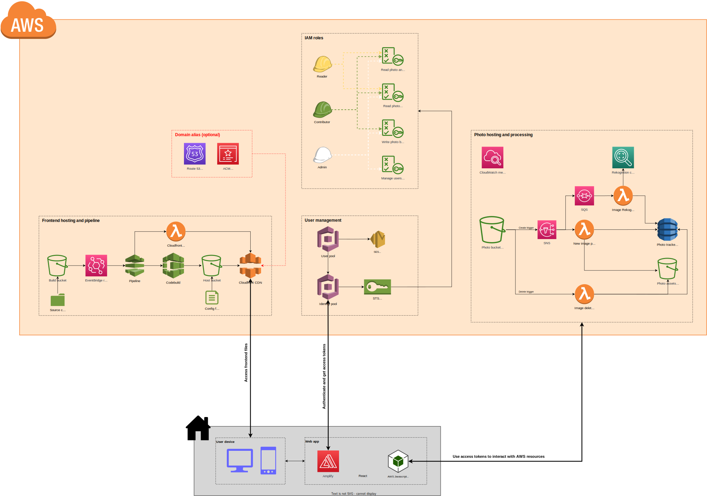

# AWS S3 PHOTO BUCKET

This is a terraform module that deploys an end to end solution to host and consume your photos using AWS resources. The main resources deployed are:

- A bucket to host original photos
- A separate bucket to store assets, like miniature versions of your photos
- Serverless resources to process photos
  - Currently, photos are processed in order to get:
    - Geohash
    - Blurhash
    - Scaled versions of the photos
    - Date
    - Type
- A DynamoDB table to track photos and properties
  - The table is designed to optimize queries
- Cognito services to manage access to your photos
- S3 bucket with a cloudfront distribution to host the app

## Diagram

